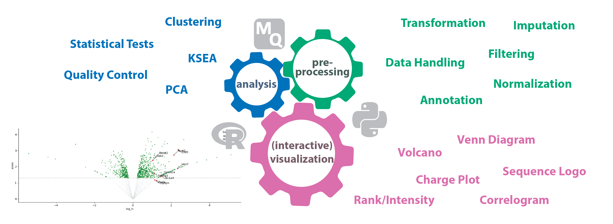

# autoprot

[](https://www.python.org/)
[](https://www.r-project.org/)
[](https://www.sphinx-doc.org/)
[](https://opensource.org/licenses/BSD-3-Clause)


[](https://ag-warscheid.github.io/autoprot/)
[](https://doi.org/10.1101/2024.01.18.571429)

## Description

autoprot streamlines and simplifies proteomics data analysis from preprocessing to visualisation.

Its main features are:
- Works with [Pandas dataframes](https://pandas.pydata.org/)
- Is modularised so that only a required submodule can be loaded for a certain task
- Connects with established [R](rhttps://r-project.org) functions for advances bio-statistical analysis
- Supports interactive visualisations made with [Plotly](https://plotly.com/)



## Installation

### Option 1: Using Conda (Recommended)

Once autoprot is published on conda-forge or anaconda.org, you can install it using:

```bash
# Create a new conda environment
conda create -n autoprot-env python=3.8

# Activate the environment
conda activate autoprot-env

# Install autoprot (once published to conda-forge)
conda install -c conda-forge autoprot
```

To build and install from the local conda recipe:

```bash
# Clone the repository
git clone --recurse-submodules https://github.com/ag-warscheid/autoprot.git
cd autoprot

# Build the conda package
conda build conda.recipe

# Install the built package
conda install --use-local autoprot
```

See [conda.recipe/README.md](conda.recipe/README.md) for more details on building and publishing the conda package.

### Option 2: Manual Installation

- Generate a new python environment using [anaconda](https://conda.io/projects/conda/en/latest/user-guide/tasks/manage-environments.html)
or [pip](https://packaging.python.org/en/latest/guides/installing-using-pip-and-virtual-environments/).
  - Install required Python packages (see [pyproject.toml](pyproject.toml)) in the environment
- Download or clone autoprot
  - If you clone the repository, make sure to include the dependencies as submodules (example below)

```
git clone --recurse-submodules https://github.com/ag-warscheid/autoprot.git
```

- If you happen for some reason to forget the submodules, you can still add them later

```
git submodule update --init --recursive
```

- Next you need to install R. Please follow the instructions at the [R manual](https://cran.r-project.org/index.html) and install R to a custom location
- Start autoprot by importing it from any Python console you like. It will generate an autoprot.conf file in the autoprot package directory that you need to edit.
  - Insert the path to your Rscript executable that you just installed as value for the R variable
  - The RFunctions variable should point the RFunctions.R file from autoprot.
- You can now either try to start using autoprot (it will automatically install required R packages) or manually trigger the install (recommended).
  - For this open your R console and start Functions.R with Rscript

```
C:\Users\User\Documents\R\R-4.1.3\bin\Rscript.exe RFunctions.R
```

- You can now start with e.g. with the example notebook [01_ap-ms.ipynb](examples%2F01_ap-ms.ipynb) provided with autoprot.
- A more detailed description of the installation can be found in [the documentation](https://ag-warscheid.github.io/autoprot/installation.html).

## Documentation
Please find the full documentation including function references at https://ag-warscheid.github.io/autoprot/installation.html.

## Contribution
If you want to contribute to the code or found a bug, please feel free to submit an issue or a pull request to https://github.com/ag-warscheid/autoprot. 
